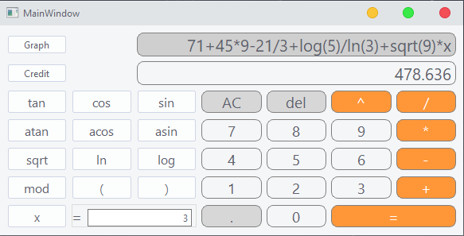
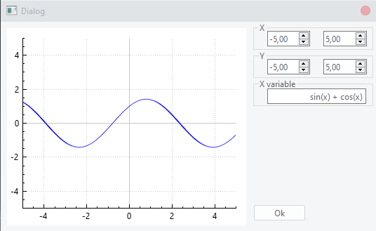
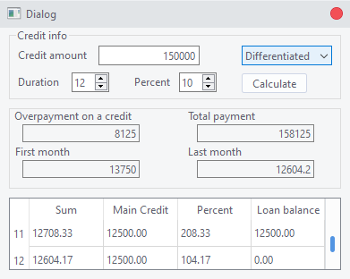

# SmartCalc_v1

### Реализация калькулятора на языке С и GUI с помощью QT.

#### Installation:
Сборка проекта с помощью [Makefile](https://github.com/GTimsan/SmartCalc_v1/blob/main/src/Makefile) и нужной цели.

Тесты и вычислительная часть написанна на языке Си:
- [Тесты](https://github.com/GTimsan/SmartCalc_v1/blob/main/src/tests.c)
- [Header](https://github.com/GTimsan/SmartCalc_v1/blob/main/src/calc.h)
- [Реализация](https://github.com/GTimsan/SmartCalc_v1/blob/main/src/calc.c)

#### Description:
Выражение проходит валидацию, после разбивается на лексемы и вычисляется(используется Алгоритм Дейкстры)

Реализована отрисовка графиков

Дополнительно кредитный калькулятор(аннуитетный, дифференцированный)

